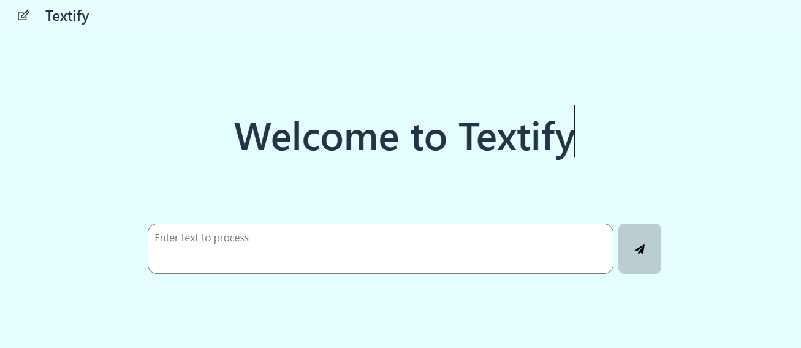
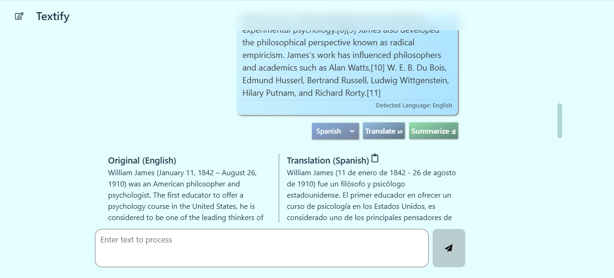

# AI-Powered Text Processing Interface

## Overview

This project is an AI-powered text processing interface that leverages **Chrome's AI APIs** to provide **summarization, translation, and language detection** capabilities. The interface is designed as a **chat-like UI**, allowing users to input text and receive processed results in an accessible and responsive format.

## Features

### Input & Output
- **Chat-style output display**, where the entered text appears immediately in the output area.

### Language Detection

- **Automatically detects the language** of the input text using the **Language Detection API**.
- The detected language is displayed below the text.

### Summarization (Only for English Texts)

- If the text is **more than 150 characters** and in **English**, a **"Summarize"** button appears below it.
- Clicking "Summarize" processes the text using **Chrome’s Summarizer API** and renders a concise summary.

### Translation

- A **language selector** (dropdown) to choose a target language.
- A **"Translate" button** to translate the output text using **Chrome’s Translator API**.
- Supported Languages:
  - English (en)
  - Portuguese (pt)
  - Spanish (es)
  - Russian (ru)
  - Turkish (tr)
  - French (fr)
- The translated text appears below the original output and can be copied.


<table>
  <tr>
    <td align="center" style="background-color:hsla(220,1%, 71%,0.1); border:1px solid hsla(220,1%, 60%,0.3)"><strong>New chat interface</strong></td>
    <td align="center" style="background-color:hsla(220,1%, 71%,0.1); border:1px solid hsla(220,1%, 60%,0.3"><strong>Translation interface</strong></td>
  </tr>
  <tr>
    <td align="center" style="border:1px solid hsla(220,1%, 60%,0.3">
      
    </td>
    <td align="center" style="border:1px solid hsla(220,1%, 60%,0.3">
      
    </td>
  </tr>
</table>


## Technologies Used

- **HTML, CSS, JavaScript (ES6+)**
- **React**
- **Chrome AI APIs** (Summarizer, Translator, Language Detection)
- **ARIA & Accessibility Features**
- **Responsive Web Design Principles**

### Responsive Design

- Optimized for **desktop, tablet, and mobile devices**.
- Flexible layout ensuring smooth usability across screen sizes.

### Accessibility Features

- **Keyboard navigability** for all interactive elements.
- **ARIA labels & focus indicators** for inputs, buttons, and outputs.
- Ensures compatibility with **screen readers**.

## 🚀 Getting Started

### Prerequisites
To sucessfully run all the models in Chrome, the following requirements should be met or taken note of:
- **Google Chrome (latest version)**
- **Windows 10 or 11; macOS 13+ (Ventura and onwards); or Linux. Chrome for Android, iOS, and ChromeOS are not yet supported by the APIs which use Gemini Nano.**
- **Storage: At least 22 GB on the volume that contains your Chrome profile.**
- **GPU: Strictly more than 4 GB of VRAM.**
- **Network: Unlimited data or an unmetered connection.**

### Installation (with Vite)

1. **Clone the repository:**
   ```sh
   git clone https://github.com/JustinX-git/hngx-stage3-text-processing-interface
   ```
2. **Install dependencies:**
   ```sh
   npm install
   ```
3. **Run the development server:**
   ```sh
   npm run dev
   ```
4. **Open in Browser:**
   - Navigate to `http://localhost:5173/`.

## 📡 Deployment

- Hosted via Netlify.
- Visit the app: [Textify](https://uziee-ai-text-processing-interface.netlify.app/)

## 📚 Study Material

- **[Chrome AI APIs Overview](https://developer.chrome.com/docs/ai/)**
- **[Summarizer API Docs](https://developer.chrome.com/docs/ai/summarizer-api)**
- **[Translator API Docs](https://developer.chrome.com/docs/ai/translator-api)**
- **[Language Detection API Docs](https://developer.chrome.com/docs/ai/language-detection)**
